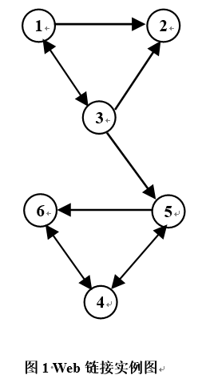
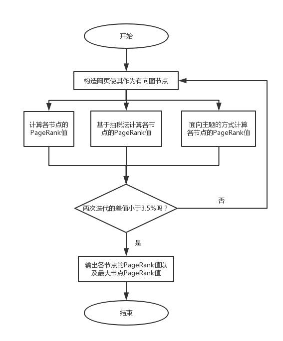
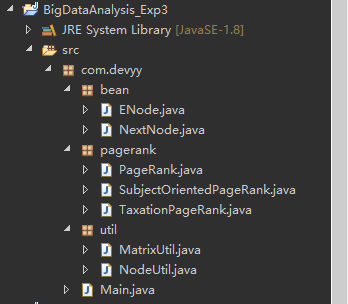
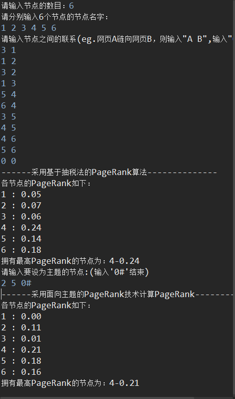

# 实时大数据分析实验三——PageRank算法
## 一、实验内容

1.采用基于“抽税”法在MapReduce框架下，分析图1的网页PageRank排名；

2.图1中，若节点②和节点⑤是主题节点，采用面向主题的PageRank算法重新计算所有节点的PageRank值。

## 二、实验设计（原理分析及流程）

## 三、实验代码及数据记录
### 1.代码 

#### 1.0 文件结构图

#### 1.1 ENode.java

	package com.devyy.bean;
	
	public class ENode {
		private String name;// 节点名字
		private NextNode nextNode;// 指向下一个节点
		private int count;// 此链表的数目
		private boolean subjectNode = false;
	
		public String getName() {
			return name;
		}
	
		public void setName(String name) {
			this.name = name;
		}
	
		public NextNode getNextNode() {
			return nextNode;
		}
	
		public void setNextNode(NextNode nextNode) {
			this.nextNode = nextNode;
		}
	
		public int getCount() {
			return count;
		}
	
		public void setCount(int count) {
			this.count = count;
		}
	
		public boolean isSubjectNode() {
			return subjectNode;
		}
	
		public void setSubjectNode(boolean subjectNode) {
			this.subjectNode = subjectNode;
		}
	}

#### 1.2 NextNode.java

	package com.devyy.bean;
	
	public class NextNode {
		private int nextLoc;// 下一个节点的数组下标
		private NextNode nextNode;// 指向下一个节点
	
		public int getNextLoc() {
			return nextLoc;
		}
	
		public void setNextLoc(int nextLoc) {
			this.nextLoc = nextLoc;
		}
	
		public NextNode getNextNode() {
			return nextNode;
		}
	
		public void setNextNode(NextNode nextNode) {
			this.nextNode = nextNode;
		}
	}

#### 1.3 PageRank.java

	package com.devyy.pagerank;
	
	import java.text.DecimalFormat;
	
	import com.devyy.bean.ENode;
	import com.devyy.bean.NextNode;
	import com.devyy.util.MatrixUtil;
	
	/** 
	 * PageRank是一个函数，它对Web中的网页赋予一个实数值，网页的PageRank值越高，它越“重要”。 
	 * 把Web想象成一个有向图，其中网页是图中节点，当满足如下两个条件时，可直接计算PageRank： 
	 * （1）图是强连通图，即可以从任一节点到达其他节点 
	 * （2）图不存在终止点，即不存在出链的节点。 
	 * 当网页数目为n时构造的n*n的方阵乘以当前概率分布向量之后值不再改变时就到达了极限。 
	 * 
	 * @author ZYY
	 * 
	 */  
	public class PageRank {
		private MatrixUtil matrixUtil =new MatrixUtil(); 
		
		// 根据邻接表构造Web转移矩阵  
	    public double[][] createTransitionMatrixFun(int number, ENode[] node){  
	        int i, index, count, temp;  
	        double[][] transitionMatrix = new double[number][number];  
	        for(i = 0; i < number; i++){  
	            count = node[i].getCount();  
	            temp = count;  
	            index = 0;  
	            NextNode nextNode = node[i].getNextNode();  
	            while(temp-- != 0){  
	                index = nextNode.getNextLoc();  
	                transitionMatrix[index][i] = 1.0 / count;  
	                nextNode = nextNode.getNextNode();  
	            }  
	        }  
	        return transitionMatrix;  
	    }  
	      
	    // 初始向量不断左乘矩阵  
	    public double[][] countValue(double[][] matrix){  
	        double value = 1.0 / matrix.length;  
	        double[][] vector = new double[matrix.length][1];  
	        double[][] result =null;  
	        int i, count = 0;  
	        for(i = 0; i < vector.length; i++){  
	            vector[i][0] = value;  
	        }  
	        while(count != vector.length){  
	            result = matrixUtil.multiMatrix(matrix, vector);  
	            count = 0;  
	            for(i = 0; i < vector.length; i++){  
	                //当上一次与本次向量点的值差值少于3%，则表示到了极限值趋于稳定了。  
	                if(Math.abs(result[i][0] - vector[i][0]) <= 0.035){  
	                    count++;  
	                }  
	            }  
	            vector = result;  
	        }  
	        return result;  
	    }  
	      
	    // 打印每个节点的PageRank，并打印拥有最高PageRank的节点  
	    public void printPageRank(double[][] vector, ENode[] node){  
	        System.out.println("各节点的PageRank如下：");  
	        DecimalFormat df = new DecimalFormat("0.00");  
	        double max = 0.0;  
	        int maxIndex = 0;  
	        for(int i = 0; i < vector.length; i++){  
	            if(vector[i][0] >= max){  
	                max = vector[i][0];  
	                maxIndex = i;  
	            }  
	            System.out.println(node[i].getName() + " : " + df.format(vector[i][0]));  
	        }  
	        System.out.println("拥有最高PageRank的节点为：" + node[maxIndex].getName() + "-" + df.format(max));  
	    }  
	      
	    // 运行PageRank算法  
	    public void runPageRank(int number, ENode[] node){  
	        System.out.println("------运行PageRank算法--------------");  
	        double[][] matrix = createTransitionMatrixFun(number, node);  
	        double[][] result = countValue(matrix);  
	        printPageRank(result, node);  
	    }  
	}

#### 1.4 SubjectOrientedPageRank.java

	package com.devyy.pagerank;
	
	import com.devyy.bean.ENode;
	import com.devyy.util.MatrixUtil;
	
	/** 
	 * 面向主题，首先确定哪些主题需要构建特定的PageRank向量 
	 * 假定S是一个网页的集合，其中的网页属于类别S(随机跳转集合)。es是一个向量，如果其分量对应的网页属于S，则该分量置为1，否则为0。 
	 * 
	 * @author ZYY
	 * 
	 */  
	public class SubjectOrientedPageRank {
		
		private PageRank pageRank = new PageRank();
		private MatrixUtil matrixUtil =new MatrixUtil(); 
		
		public static final double BETA = 0.8;  
	    // 设置主题节点  
	    public ENode[] dealWithSubjectNode(String[] strArr, int count, ENode[] node){  
	        while(count > 0){  
	            for(int i = 0; i < node.length; i++){  
	                if(node[i].getName().equals(strArr[count - 1])){  
	                    node[i].setSubjectNode(true);  
	                    break;  
	                }  
	            }  
	            count--;  
	        }  
	        return node;  
	    }  
	      
	    // 使用迭代公式vector' = beta * Matrix * vector + (1 - beta) * es / |S|  
	    public double[][] useFormula(int number, ENode[] node, int count){  
	        double[][] matrix = pageRank.createTransitionMatrixFun(number, node);  
	        double value1 = 1.0 / matrix.length;  
	        double value2 = 1.0 / count * (1 - BETA);  
	        double[][] vector1 = new double[matrix.length][1];  
	        double[][] vector2 = new double[matrix.length][1];  
	        double[][] result =null;  
	        int i, counted = 0;  
	        for(i = 0; i < vector1.length; i++){  
	            vector1[i][0] = value1;  
	        }  
	        for(i = 0; i < vector2.length; i++){  
	            if(node[i].isSubjectNode()){  
	                vector2[i][0] = value2;  
	            }else{  
	                vector2[i][0] = 0;  
	            }  
	        }  
	        while(counted != vector1.length){  
	            result = matrixUtil.addMatrix(matrixUtil.RealMulMatrix(matrixUtil.multiMatrix(matrix, vector1), BETA), vector2);  
	            counted = 0;  
	            for(i = 0; i < vector1.length; i++){  
	                //当上一次与本次向量点的值差值少于3.5%，则表示到了极限值趋于稳定了。  
	                if(Math.abs(result[i][0] - vector1[i][0]) <= 0.035){  
	                    counted++;  
	                }  
	            }  
	            vector1 = result;  
	        }  
	        return result;  
	    }  
	      
	    // 采用面向主题的PageRank技术计算PageRank  
	    public void countPageRankBySubjectOriented(int number, ENode[] node, int count, String[] strArr){  
	        System.out.println("------采用面向主题的PageRank技术计算PageRank--------------");  
	        node = dealWithSubjectNode(strArr, count, node);  
	        double[][] result = useFormula(number, node, count);  
	        pageRank.printPageRank(result, node);  
	    }  
	
	}

#### 1.5 TaxationPageRank

	package com.devyy.pagerank;
	
	import com.devyy.bean.ENode;
	import com.devyy.util.MatrixUtil;
	
	/** 
	 * 抽税法允许每个冲浪者能够以一个较小的概率随机跳转到一个随机网页，而不一定要沿着当前网页的出链前进，从而避免了采集器陷阱或者终止点问题。 
	 * vector' = beta * Matrix * vector + (1 - beta) * e / n，其中beta是抽税参数，1 - beta表示抽出的税率 
	 * 
	 * @author ZYY
	 * 
	 */  
	public class TaxationPageRank {
	
		private PageRank pageRank = new PageRank();
		private MatrixUtil matrixUtil =new MatrixUtil(); 
		
		public static final double BETA = 0.8;  	
		
	    // 使用迭代公式vector' = beta * Matrix * vector + (1 - beta) * e / n  
	    public double[][] useFormula(int number, ENode[] node){  
	        double[][] matrix = pageRank.createTransitionMatrixFun(number, node);  
	        double value1 = 1.0 / matrix.length;  
	        double value2 = 1.0 / matrix.length * (1 - BETA);  
	        double[][] vector1 = new double[matrix.length][1];  
	        double[][] vector2 = new double[matrix.length][1];  
	        double[][] result =null;  
	        int i, count = 0;  
	        for(i = 0; i < vector1.length; i++){  
	            vector1[i][0] = value1;  
	        }  
	        for(i = 0; i < vector2.length; i++){  
	            vector2[i][0] = value2;  
	        }  
	        while(count != vector1.length){  
	            result = matrixUtil.addMatrix(matrixUtil.RealMulMatrix(matrixUtil.multiMatrix(matrix, vector1), BETA), vector2);  
	            count = 0;  
	            for(i = 0; i < vector1.length; i++){  
	                //当上一次与本次向量点的值差值少于3.5%，则表示到了极限值趋于稳定了。  
	                if(Math.abs(result[i][0] - vector1[i][0]) <= 0.035){  
	                    count++;  
	                }  
	            }  
	            vector1 = result;  
	        }  
	        return result;  
	    }  
	      
	    // 采用抽税法计算PageRank  
	    public void countPageRankByTaxation(int number, ENode[] node){  
	        System.out.println("------采用基于抽税法的PageRank算法--------------");  
	        double[][] result = useFormula(number, node);  
	        pageRank.printPageRank(result, node);  
	    }  
	}

#### 1.6 MatrixUtil.java

	package com.devyy.util;
	
	/** 
	 * 矩阵工具类，处理矩阵的相关运算 
	 * 
	 * @author ZYY
	 * 
	 */  
	public class MatrixUtil {
		// 两个矩阵乘法运算
		public double[][] multiMatrix(double[][] a, double[][] b) {
			if (a[0].length != b.length) {
				System.out.println("矩阵无法相乘，请确定行列维度后再重试！");
				return null;
			} else {
				double[][] result = new double[a.length][b[0].length];
				int temp;
				double sum = 0.0;
				for (int row = 0; row < a.length; row++) {
					for (int col = 0; col < b[0].length; col++) {
						sum = 0.0;
						for (temp = 0; temp < a[0].length; temp++) {
							sum += a[row][temp] * b[temp][col];
						}
						result[row][col] = sum;
					}
				}
				return result;
			}
		}
	
		// 矩阵乘以一个实数
		public double[][] RealMulMatrix(double[][] a, double number) {
			for (int i = 0; i < a.length; i++) {
				for (int j = 0; j < a[0].length; j++) {
					a[i][j] = number * a[i][j];
				}
			}
			return a;
		}
	
		// 矩阵加法运算
		public double[][] addMatrix(double[][] a, double[][] b) {
			if (a.length != b.length || a[0].length != b[0].length) {
				System.out.println("矩阵无法相加，请确定行列维度后再重试！");
				return null;
			} else {
				double result[][] = new double[a.length][a[0].length];
				int i, j;
				for (i = 0; i < a.length; i++) {
					for (j = 0; j < a[0].length; j++) {
						result[i][j] = a[i][j] + b[i][j];
					}
				}
				return result;
			}
		}
	}

#### 1.7 NodeUtil.java

	package com.devyy.util;
	
	import java.util.Scanner;
	
	import com.devyy.bean.ENode;
	import com.devyy.bean.NextNode;
	
	/** 
	 * 构造节点，根据实验要求最简单的方式应该是构造二维数组来存放节点，即邻接矩阵的方式来存放有向图，但此类尝试使用邻接表的方式来存放该有向图降低空间复杂度。 
	 * 邻接矩阵的方式来存放有向图较简单，故此类中不实现。 
	 * 
	 * @author ZYY
	 * 
	 */  
	public class NodeUtil {
		// 生成节点及节点之间的关系
		public ENode[] createNode(int number) {
			int i, j, count;
			String key, value;
			boolean flag = true;
			ENode[] node = new ENode[number];
			System.out.println("请分别输入" + number + "个节点的节点名字：");
			@SuppressWarnings("resource")
			Scanner sc = new Scanner(System.in);
			for (i = 0; i < number; i++) {
				ENode childNode = new ENode();
				childNode.setName(sc.next());
				childNode.setNextNode(null);
				node[i] = childNode;
			}
			System.out.println("请输入节点之间的联系(eg.网页A链向网页B，则输入\"A B\",输入\"0 0 \"结束)");
			// 如果采用二维数组存放联系，若有向图由10000个网站节点构成，则需要10000 * 10000的空间，内存浪费严重，因此直接使用邻接矩阵来存放联系
			while (flag) {
				key = sc.next();
				value = sc.next();
				if ("0".equals(key) && "0".equals(value)) {
					flag = false;
				} else {
					// 相比二维数组，时间复杂度高了一个数量级，但存储所需空间少了，用时间复杂度来换取空间复杂度
					for (i = 0; i < number; i++) {
						if (node[i].getName().equals(key)) {
							for (j = 0; j < number; j++) {
								// 使用头插法
								if (node[j].getName().equals(value)) {
									NextNode nextNode = new NextNode();
									NextNode backwardNode = node[i].getNextNode();
									nextNode.setNextLoc(j);
									nextNode.setNextNode(backwardNode);
									node[i].setNextNode(nextNode);
									break;
								}
							}
							break;
						}
					}
				}
			}
			// 本身邻接表无须加count属性，但计算count是为了后面的PageRank算法的便捷
			for (i = 0; i < number; i++) {
				count = 0;
				NextNode nextNode = node[i].getNextNode();
				while (nextNode != null) {
					count++;
					nextNode = nextNode.getNextNode();
				}
				node[i].setCount(count);
	//			System.out.println(node[i].toString());
			}
			return node;
		}
	}

#### 1.8 Main.java

	package com.devyy;
	
	import java.util.Scanner;
	
	import com.devyy.bean.ENode;
	import com.devyy.pagerank.SubjectOrientedPageRank;
	import com.devyy.pagerank.TaxationPageRank;
	import com.devyy.util.NodeUtil;
	
	public class Main {
		public static void main(String[] args) {
			// PageRank pageRank = new PageRank();
			TaxationPageRank taxationPageRank = new TaxationPageRank();
			SubjectOrientedPageRank subjectOrientedPageRank = new SubjectOrientedPageRank();
			NodeUtil nodeUtil = new NodeUtil();
	
			Scanner sc = new Scanner(System.in);
			System.out.print("请输入节点的数目：");
			int number = sc.nextInt();
			ENode[] node = nodeUtil.createNode(number);
			// pageRank.runPageRank(number, node);
			taxationPageRank.countPageRankByTaxation(number, node);
			System.out.println("请输入要设为主题的节点:(输入'0#'结束)");
			String input = sc.next();
			String[] strArr = new String[number];
			int i = 0, count = 0;
			while (!"0#".equals(input)) {
				strArr[i] = input;
				count++;
				input = sc.next();
				i++;
			}
			subjectOrientedPageRank.countPageRankBySubjectOriented(number, node, count, strArr);
			sc.close();
		}
	}

### 2. 结果截图

